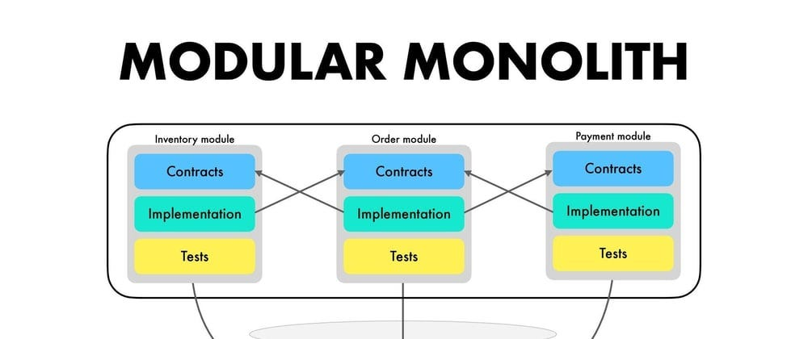
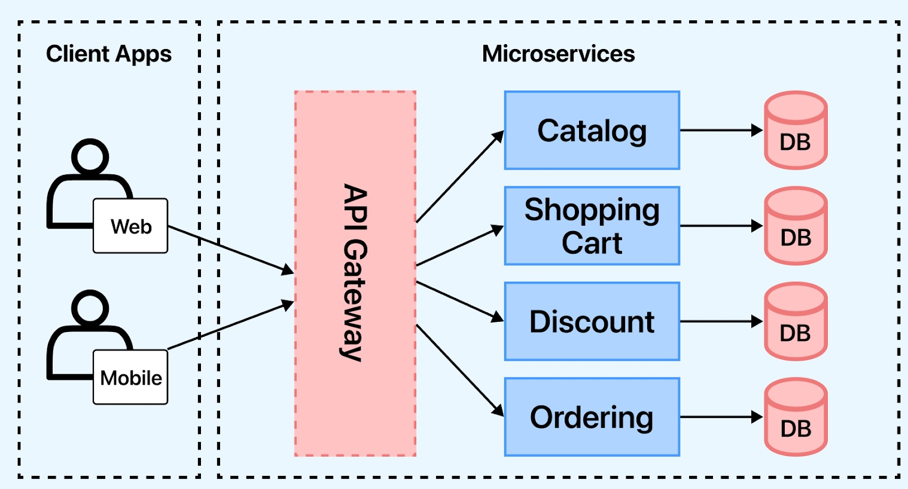
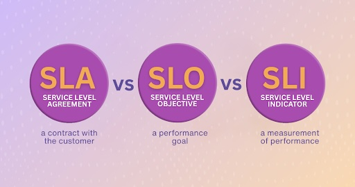
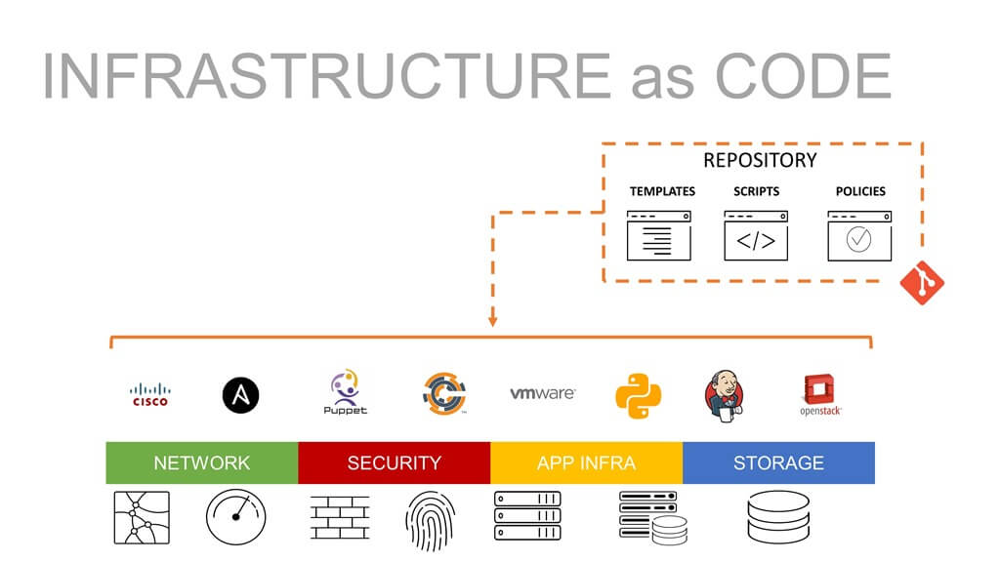
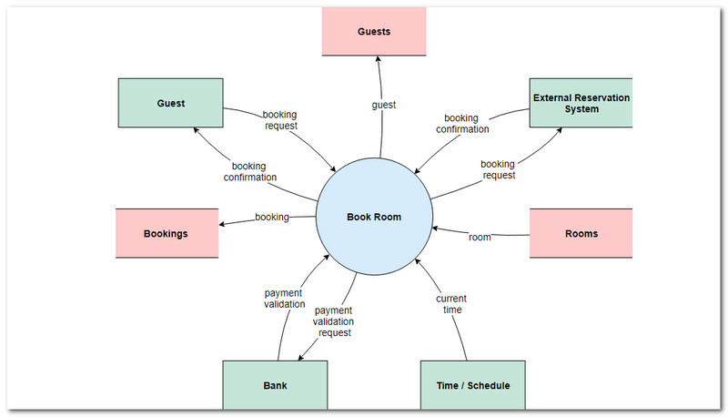
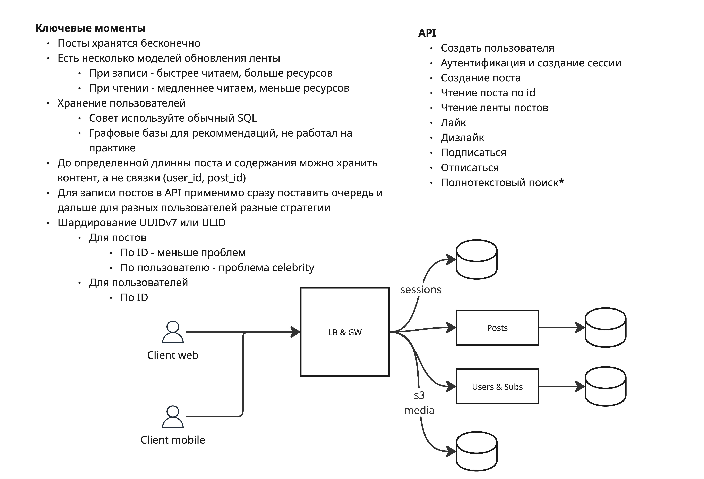
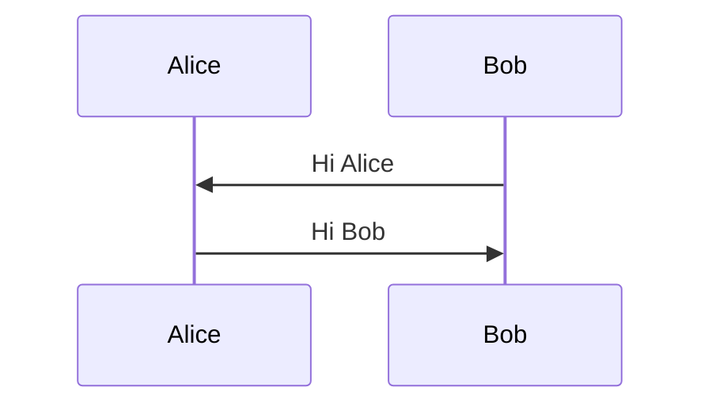
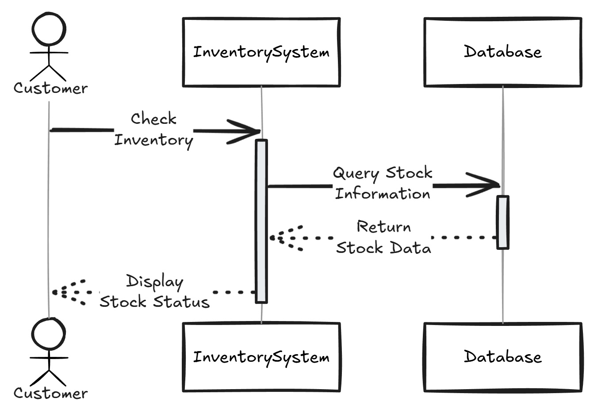

+++
title = 'Архитектурные подходы, декомпозиция и границы системы'
weight = 1
+++
# Архитектурные подходы, декомпозиция и границы системы

## Содержимое главы

- Почему не существует единственной правильной архитектуры систем и приложений
- Современные архитектурные подходы (когда и какие применимы)
  - Монолит
  - Модульный монолит
  - Микросервисы
  - Распределенный монолит (distributed monolith)
- Какие ограничения формируют архитектуру системы (бизнес, команда, инфраструктура, SLA)
- Декомпозиция и разделение данных по домену, границы системы и сервисов, владение данными (ownership)
- Способы фиксации архитектуры
- Практика

## Как проектируют современные приложения


На практике почти не существует кейсов, когда приложения проектируются:

- С чистого листа
- Без ограничений
- Без предыдущей системы с проблемами (legacy)

В этом модуле мы рассмотрим два принципиально разных сценария:

- Проектирование новой системы
- Развитие и изменение существующей системы

При этом в "новых" системах почти всегда есть

- Интеграции с существующими или глобальными системами(например google oauth)
- Архитектурные решения текущей компании
- Ограничения инфраструктуры и команды

## Почему не существует единственной правильной архитектуры

Архитектура системы почти никогда не существует вне контекста. Одно и то же решение может быть успешным в одной системе и разрушительным в другой.

Любая архитектура формируется под воздействием множества факторов. Бизнес определяет скорость изменений, допустимый риск и стоимость простоя. Команда накладывает ограничения на сложность решений, уровень автономности и способы коммуникации. Нагрузка и профиль использования диктуют требования к масштабируемости и задержкам. Инфраструктура и бюджет задают границы возможного. Архитектурное решение всегда является следствием этих ограничений, а не идеалов и желания разработчиков.

Примеры из реальной практики:

- Архитектура для стартапа ≠ архитектура для банка
- 3-20 разработчиков → микросервисы замедляют процессы
- 100+ разработчиков → в монолите становится тесно
- Архитектура для real-time приложений ≠ архитектура для batch аналитической обработки
- Облачная или собственная инфраструктура

Из этого напрямую следует, что архитектура - это всегда набор компромиссов. Оптимизируя систему под одну цель, мы неизбежно жертвуем чем-то другим. Простота разработки часто конфликтует с масштабируемостью, строгая консистентность — с доступностью, автономность компонентов - с общей сложностью системы. Невозможно одновременно получить максимальную гибкость, простоту и надёжность. Если архитектура выглядит так, будто она "оптимальна во всём", значит компромиссы просто не были осознаны или зафиксированы.

## Современные архитектурные подходы

В современной backend-разработке под архитектурными подходами обычно понимают способы организации приложения и его компонентов, которые определяют границы ответственности, способы взаимодействия и эволюции системы.

На практике чаще всего встречаются четыре подхода: монолит, модульный монолит, микросервисы и распределённый монолит.

### Монолит

Монолит — самый простой и часто самый эффективный способ начать разработку системы. В монолитной архитектуре всё приложение поставляется и запускается как единое целое: один деплой, одна кодовая база, обычно одно хранилище данных (может быть и несколько разных под разные задачи). Такое решение минимизирует количество границ внутри системы, снижает когнитивную нагрузку и упрощает разработку, упрощает навигацию по кодовой базе, контракты обозначены интерфейсами языка программирования, а не сетевыми вызовами. Монолит позволяет использовать локальные транзакции, писать простой код и быстро вносить изменения. Именно поэтому большинство успешных продуктов начинали с монолита, даже если позже перешли к более сложным архитектурам.

Проблемы монолита появляются не сразу, а по мере роста системы. Кодовая база увеличивается, связи между частями становятся неявными (плохая модульность поражает циклические зависимости и @Lazy инициализации), изменения начинают затрагивать всё больше компонентов. Масштабирование становится грубым (чуть менее грубым, если модули возможно запускать изолированно, например разбиты maven профили) — приходится масштабировать всё приложение целиком, даже если нагрузка растёт лишь на отдельный функционал. При отсутствии архитектурной дисциплины монолит постепенно превращается в "большой комок грязи", где **любое изменение становится рискованным**.

На практике я сталкивался с проблемами монолита следующего рода

- Время полной компиляции проекта превышает 4 часа, без инкрементальных сборок или если необходима полная пересборка
- Тесты точно также начинают идти очень долго и общая стабильность тестов сильно снижается, моргают тесты кода, который ты не трогал
- Невозможность выполнения тестов локально, ресурсов машины разработчика не хватает, тесты запускаются частично на куче агентов
- Правка любого минорного места требует перезапуска всего (сборки, тестов), как результат TTM у фичей с часа превращается в несколько дней
- Система слишком большая, физически в голове невозможно все запомнить, где и что лежит, каждый раз исследование, что может пойти не так
- Очень тяжелая раскатка, куча графиков и мониторинга, следим за всем сразу


### Модульный монолит

Модульный монолит можно рассматривать как эволюцию классического монолита. Снаружи это всё ещё один сервис и один деплой(может быть уже несколько, по модулям), но внутри система разделена на жёстко изолированные модули с явными границами и контрактами. Модули владеют своими моделями данных и бизнес-логикой, а взаимодействие между ними контролируется архитектурно (например через архитектурные тесты и использование интерфейсов), а не договорённостями разработчиков. Такой подход позволяет сохранить простоту эксплуатации монолита, одновременно снижая связанность и подготавливая систему к возможному дальнейшему разделению.

Отличный подход для систем среднего размера и команд, которые хотят контролировать сложность, не платя цену распределённой архитектуры и зрелых систем, однако контролировать и соблюдать требования по разбиению на модули и интерфейсы, крайне необходимо, иначе возможен откат к обычному монолиту.

Во многих случаях правильно спроектированный модульный монолит способен жить годами без необходимости перехода к микросервисам.



### Микросервисы

Микросервисная архитектура предполагает разделение системы на автономные сервисы, каждый из которых имеет собственный жизненный цикл(разработку, раскатку, откат), данные(разные субд под разные задачи) и ответственность(критичность системы платежей гораздо важнее чем отправки email). Такие сервисы взаимодействуют между собой через сеть, используя синхронные или асинхронные контракты. Основное преимущество микросервисов заключается не в технических деталях, а в организационных возможностях: независимые команды могут развивать свои сервисы без координации на каждом шаге, масштабировать только нужные части системы и выбирать технологии под конкретные задачи (например использовать другие языки программирования и фреймворки подходящие под задачу).

Однако микросервисы **резко повышают сложность системы**. Появляются сетевые отказы, частичные сбои, проблемы консистентности данных и необходимость развитой observability, системы развертывания и способа управления сетевыми вызовами между системами. То, что раньше решалось локальным вызовом функции, **превращается в распределённое взаимодействие** с таймаутами, ретраями и отказами.

Микросервисная архитектура оправдана только тогда, когда выгоды от автономности превышают стоимость этой сложности.



### Распределенный монолит

Распределённый монолит — это не архитектурный подход, а **результат ошибок при проектировании**. Он возникает, когда система формально разбита на сервисы, но при этом остаётся жёстко связанной. Сервисы зависят друг от друга через синхронные вызовы, используют общую базу данных или требуют совместных одновременных релизов. В результате система **получает все минусы распределённой архитектуры** без её преимуществ: сложность эксплуатации, каскадные отказы и медленное развитие.

Распределённый монолит часто появляется как следствие преждевременного перехода к микросервисам или неправильной декомпозиции. Он является хорошим индикатором того, что границы системы были выбраны неправильно или что организационная структура не соответствует выбранной архитектуре.

### Эволюционная архитектура

Подходы не образуют линейную лестницу развития, по которой "нужно" пройти. **Монолит не является упрощённой версией** микросервисов, а микросервисы — не улучшенным монолитом. Это разные ответы на разные вопросы. Архитектурный выбор должен исходить из текущих целей, ограничений и понимания того, как система будет развиваться дальше.

Современное проектирование систем всё чаще рассматривает архитектуру как эволюционный процесс. Система может начинаться как монолит, затем стать модульным монолитом, а позже частично или полностью перейти к микросервисам, а с ошибкам в разделении доменов и модульным монолитом.

## Какие ограничения формируют архитектуру системы

Правильное архитектурное решение начинается не с выбора паттернов, а с понимания того, что именно ограничивает систему и команду прямо сейчас.

### Бизнес ограничения

Бизнес — это главный источник архитектурных требований, даже если они не всегда формулируются явно. Архитектура напрямую зависит от того, что для бизнеса важнее: скорость вывода фич, стабильность, минимизация затрат или способность масштабироваться.

Например, стартап на ранней стадии почти всегда оптимизирует скорость изменений и TTM (time-to-market). В таком контексте архитектура, требующая сложной инфраструктуры, множества сервисов и координации релизов, становится тормозом. Даже если такая архитектура "масштабируема", бизнес до этого масштаба может просто не дожить. Поэтому монолит или модульный монолит часто оказываются более правильным выбором, чем микросервисы.

В противоположной ситуации, когда система уже является критичной для бизнеса и простой стоит дорого (например, финтех или e-commerce на обработке платежей), архитектура вынуждена учитывать изоляцию отказов, деградацию и независимые релизы. Здесь сложность оправдана, потому что цена ошибки высока.


Бизнес также формирует SLA — это ожидание от системы, и оно напрямую влияет на архитектурные решения. Чем выше требования к доступности и задержкам, тем дороже становится архитектура.

Система с мягкими требованиями к доступности может позволить себе простые решения, редкие даунтаймы и синхронные зависимости. В системе с жёсткими SLA приходится закладывать изоляцию отказов, деградацию функциональности, резервирование и более сложные схемы взаимодействия.

Например, если простой в несколько минут допустим, архитектура может быть существенно проще. Если же каждая минута простоя означает прямые финансовые потери, архитектура вынуждена учитывать отказоустойчивость на всех уровнях, даже ценой усложнения разработки.



### Ограничения команды

Размер команды, уровень её зрелости и способ коммуникации напрямую влияют на то, какие архитектурные решения будут устойчивыми.

Небольшая команда из нескольких разработчиков почти всегда работает эффективнее с монолитом. В таком контексте микросервисы увеличивают когнитивную нагрузку: вместо решения бизнес-задач команда начинает заниматься инфраструктурой, деплоями и синхронизацией изменений.

С ростом команды появляются другие проблемы: конфликты в коде, зависимые релизы, сложность согласования изменений. В этот момент разделение системы по доменам и автономным зонам ответственности становится необходимостью, примерно это писывается [законом Конвея](https://habr.com/ru/companies/engelbart/articles/432972/). Архитектура системы неизбежно повторяет структуру коммуникаций внутри организации.

### Инфраструктурные ограничения

Организация внутри может быть не готовой к масштабированию команды сопровождения и эксплуатации систем.
Текущие решения по развертыванию работают стабильно уже несколько лет, а внедрять новые способы или переходить на облачные решения может быть затратно или вообще невозможно для on-premise решений (развертывание системы у заказчика), например ограничено только собственным железом **без доступа к сети**.

Или обратная проблема у стартапов чаще всего вся инфраструктура сразу облачная и невозможно представить полноценный сервер с прямой шаговой доступностью, ограничение по производительности у сетевых и облачных систем тоже существуют. Каждый уровень виртуализации добавляет задержки.
Например для компании занимающейся сетевым оборудованием будет странно тестировать и прводить замеры без "своих железок".

Сюда же можно отнести ограничения по языкам программирования и техническому стеку, во многих компаниях есть предпочитаемые технологии для разработки и хранения данных, также возможны внешние ограничения (на практике связаны с субд и использование open-source решений).



## Декомпозиция и разделение данных по домену

Проектирование архитектуры в реальности почти всегда сводится к одному вопросу: где провести границы. Не между классами и модулями, а между частями системы, которые будут развиваться, масштабироваться и ломаться независимо друг от друга.

### Декомпозиция по домену

Домен отражает часть предметной области с собственными бизнес-правилами, терминами и моделью данных (помогают найти общий язык в команде). Именно домены определяют, какие изменения будут происходить вместе, а какие — независимо. Если **два компонента системы почти всегда меняются одновременно**, это сигнал, что они принадлежат одному домену, даже если технически выглядят разными.

Идеи доменной декомпозиции хорошо описаны в Domain-Driven Design, в частности в концепции bounded context. Bounded context задаёт границы, внутри которых модель данных и язык имеют однозначное значение. За пределами этого контекста те же термины могут означать совсем другое. Например, "заказ" в домене оформления заказа и "заказ»" в домене биллинга — это разные сущности, несмотря на одинаковое название.

### Границы системы

Границы системы или сервиса — это всегда точки повышенной стоимости. На границе появляются контракты, сетевые вызовы, задержки, частичные отказы и необходимость версионирования (или опциональные параметры в существующих контрактах). Каждая новая граница увеличивает сложность системы, поэтому их количество и расположение должны быть осознанными. Ошибка начинающих архитекторов — проводить границы слишком рано и слишком мелко, превращая систему в набор тесно связанных сервисов.

Хорошая граница позволяет одной части системы меняться без необходимости немедленно менять другую. Это не означает полного отсутствия взаимодействия, но взаимодействие должно происходить через стабильные контракты.
Если изменение в одном сервисе регулярно требует синхронных изменений в других, граница выбрана неправильно или нарушается на практике.

### Владение данными

Принцип "один домен — один источник истины" означает, что только один сервис или модуль имеет право изменять конкретные данные. Все остальные получают доступ к этим данным либо через публичные API, либо через события. Прямой доступ к базе данных другого сервиса разрушает границы и приводит к жёсткой связанности.

**Нарушение владения данными** — один из самых частых путей к распределённому монолиту. Общая база данных между сервисами кажется удобным решением на старте, но со временем она делает независимую эволюцию компонентов невозможной. Любое изменение схемы данных начинает требовать согласованных релизов, а отказ одного сервиса может повлиять на всю систему.

#### Общие транзакции на несколько систем

Разделение данных по домену почти всегда приводит к отказу от глобальных транзакций. Вместо этого используются асинхронные взаимодействия, eventual consistency и события. Это увеличивает сложность, но именно эта сложность позволяет системе масштабироваться и развиваться независимо. Попытки сохранить "удобство" локальных транзакций в распределённой архитектуре почти всегда заканчиваются проблемами. Существуют паттерны, которые позволяют реализовать распределенные транзакции в нескольких хранилищах, 2PC, SAGA, Outbox и тд, которые будут разобраны в следующих главах.

По мере развития продукта домены могут меняться, укрупняться или, наоборот, дробиться. Хорошая архитектура допускает такие изменения без полного переписывания системы

## Способы развития систем

### Проектирование новых систем

Новые системы появляются как эволюционные или независимые части существующей системы, при этом формируются список **ключевых фичей** и потенциальное техническое решение, формализуются технические ограничения.
На старте не требуется идеально подходящее архитектурное решение, достаточно выбрать правильную ставку и по мере роста и развития системы эволюционно решать проблемы.
Поэтому не стоит сразу:

- Строить идеальную распределенную систему
- Выбирать микросервисы, "чтобы масштабировалось", гораздо проще организовать процесс работы в рамках одного сервиса и эволюционно **и при необходимости** его разбивать
- Оптимизировать код под пиковые нагрузки, будущее проекта еще не решено, неизвестно будут ли пользователи

### Проектирование существующих систем

Ключевое отличие от новых систем, что эти системы уже запущены, есть пользователи, эксплуатация, бизнес-процесс вокруг системы, баги и существующие обходные пути, чаще всего такие системы невозможно переписать целиком, потому что это не целесообразно или потребует нескольких лет работы крупной команды, поэтому вместо большого дизайна в моменте используют:

- Инкрементальные изменения
- Локальные улучшения
- Изоляцию проблемных зон
- Постепенное введение и интеграцию новых компонентов
- Обратная совместимость изменений

В отличии от предыдущего пункта, тут необходимо

- Новые решения должны работать как минимум не хуже предыдущих по производительности (а чаще всего ожидается, что гораздо лучше)
- Должны выдерживать текущую нагрузку и адаптироваться под масштаб

## Виды схем для зарисовки архитектуры

Архитектурные схемы в реальных проектах почти никогда не являются строгими нотациями. Их основная задача — помочь людям договориться, а не соответствовать стандарту. Хорошая схема отвечает на конкретный вопрос и живёт ровно до тех пор, пока этот вопрос актуален.

### Контекстная диаграмма системы

Самый базовый — это [контекстная схема системы](https://www.mindonmap.com/ru/blog/context-diagram/). Она отвечает на вопрос: что это за система и в каком окружении она существует. На такой схеме показывают саму систему как чёрный ящик, внешних пользователей, соседние системы, внешние сервисы и каналы взаимодействия. Здесь не важно, HTTP это или Kafka, база данных или кеш — важно понять границы ответственности и внешние зависимости. Контекстная схема особенно полезна для онбординга, обсуждения границ и общения с заказчиками.

Пример


### Схема основных компонентов

Следующий уровень — схема основных компонентов внутри системы. Она показывает, из каких крупных частей состоит система и как они взаимодействуют между собой. Это может быть сервис, модуль, bounded context или просто логический компонент — в зависимости от выбранной архитектуры. Такие схемы помогают обсуждать декомпозицию, ответственность компонентов и потоки данных. На этом уровне важно избегать детализации: если на схеме появляются классы или код, она перестаёт выполнять свою задачу.

Пример, схема для system-design интервью, очень похожа


### Схемы сценариев

На практике это единственное место, где очень сильно используется [UML нотация](https://practicum.yandex.ru/blog/uml-diagrammy/#tipy-diagramm) и диаграммы последовательностей.
Используем входной бизнес-процесс и разбиваем его на части и обращения к другим системам.
Эта схема вполне себе может быть многоуровневой, но чаще всего используется как набор сценариев, встречается постоянно при проектирование новых частей существующей системы и существует в сравнении.
Может содержать технические детали и endpoint'ы, а может включать только high-level сущности, зависит от детализации уровня.

Пример диаграммы сгенерированной через mermaid


Код, можно воспользоваться [онлайн-редактором](https://mermaid.live)
```sh
sequenceDiagram
    participant Alice
    participant Bob
    Bob->>Alice: Hi Alice
    Alice->>Bob: Hi Bob
```

Пример в любом другом редакторе


Важно помнить, что одна и та же система может и должна иметь несколько разных схем. Попытка сделать "универсальную" диаграмму приводит к перегруженным изображениям, которые никто не использует. Гораздо эффективнее иметь набор простых схем, каждая из которых решает свою проблему.

### Инструменты для построения схем

Список инструментов, в которых удобно строить схемы и управлять визуалом.

- [Miro](htttps://miro.com)
- [Excalidraw](https://excalidraw.com/)
- [Plant UML для управления кодом](https://plantuml.com/)
- [Mermaid.js для управления через код](https://mermaid.js.org/)

### Инструменты для ведения лога решений

В крупных проектах архитектура постоянно меняется, и без фиксации решений быстро теряется понимание, почему система устроена именно так. Для этого используют лог архитектурных решений — Architectural Decision Records (ADR). ADR — это простой текстовый файл или markdown-документ, в котором фиксируется конкретное архитектурное решение, контекст, альтернативы и мотивация выбора.

Каждый ADR обычно содержит следующие блоки.

- Контекст — какие проблемы или ограничения существовали.
- Решение — что было выбрано.
- Альтернативы — что рассматривалось, и почему не подошло.
- Последствия — плюсы, минусы, возможные риски.

Советую шаблон [light-weight-adr](https://github.com/peter-evans/lightweight-architecture-decision-records)

Пример

```md
# ADR 001: Выбор базы данных для системы заказов

## Контекст
Система должна обрабатывать 1000+ заказов в минуту с требованием к консистентности данных. 

## Решение
Используем PostgreSQL как основной источник правды для заказов, Kafka — для асинхронной репликации в read-оптимизированные хранилища.

## Альтернативы
- MongoDB: слишком слабая поддержка транзакций.
- MySQL: аналогично PostgreSQL, но команда меньше знакома.

## Последствия
- Плюсы: ACID, проверенные инструменты, зрелое сообщество.
- Минусы: масштабирование write-heavy нагрузки требует шардирования.

```

В Java используют [jep для решения подобной проблемы](https://openjdk.org/jeps/0).

## Антипаттерн "правильной архитектуры"

Антипаттерн "правильной архитектуры" проявляется тогда, когда архитектурные решения принимаются не из реальных требований системы, а из абстрактных представлений "как должно быть". Типичные примеры - стремление **сразу строить микросервисную архитектуру** "потому что будет поздно" или копирование решений крупных компаний без понимания их контекста. Например, стартап с небольшой командой и неустойчивыми требованиями начинает с десятка сервисов, Kafka и service mesh, хотя реальная задача — быстро проверять гипотезы и менять бизнес-логику. В результате архитектура усложняется раньше, чем появляется необходимость в этой сложности.

Итогом такого подхода часто становится преждевременная сложность и распределённый монолит. Сервисы оказываются жёстко связаны, требуют совместных релизов и общих изменений схем данных, а отказ одного компонента влияет на всю систему. Вместо ожидаемой гибкости команда получает снижение скорости разработки и рост операционных проблем. Хорошая архитектура в этом контексте — не "правильная" и не "best practice", а та, которая решает текущие проблемы системы и оставляет пространство для эволюции, а не усложняет её без необходимости.

## Дополнительные источники для изучения

- Большой ком грязи [оригинал](http://www.laputan.org/mud/) и [перевод](https://habr.com/ru/articles/351686/) и [хорошая статья](https://www.geeksforgeeks.org/system-design/big-ball-of-mud-anti-pattern/)
- [Блог автора microservice patterns](https://microservices.io/patterns/microservices.html)
- Мой ролик [зачем всем микросервисы](https://www.youtube.com/watch?v=rm0VUS3th44)
- [Паттерны микросервисных архитектур](https://medium.com/javarevisited/24-microservices-patterns-every-developer-should-know-f98283a908b0)
- [Закон Конвея](https://habr.com/ru/companies/engelbart/articles/432972/)
- Working Effectively with Legacy Code, Michael Feathers
- Design Patterns: Elements of Reusable Object-Oriented Software, Erich Gamma
- Refactoring: Improving the Design of Existing Code и Patterns of Enterprise Application Architecture, Martin Fowler
- Code Complete: A Practical Handbook of Software Construction, Steve McConnell
- [Martin Fowler — Is High Quality Software Worth the Cost?](https://martinfowler.com/articles/is-quality-worth-cost.html)
- Eric Evans — Domain-Driven Design
- Vaughn Vernon — Implementing Domain-Driven Design
- Sam Newman — Building Microservices
- Team Topologies — Matthew Skelton, Manuel Pais
- [Мой ролик про NFR](www.youtube.com/watch?v=lUwJZzSdlkE)
- Brendan Burns — Designing Distributed Systems
- Высоконагруженные приложения. Программирование, масштабирование, поддержка, Клеппман Мартин
- Google SRE Book
- Nygard — Release It!
- [Martin Fowler — Bounded Context](https://www.martinfowler.com/bliki/BoundedContext.html)
- Chris Richardson — Microservices Patterns
- Код, который умещается в голове, Марк Симан
- [Блог netflix про resilence](https://netflixtechblog.com/all?topic=resilience)
- [Как составить контекстную диаграмму](https://systems.education/context-diagram#showmore)
- [Шаблон light-weight-adr](https://github.com/peter-evans/lightweight-architecture-decision-records)
- [Мой ролик про adr](https://www.youtube.com/watch?v=Nb6xvaFfm7k)
- [Виды uml диаграмм](https://practicum.yandex.ru/blog/uml-diagrammy/#tipy-diagramm)

## Практика (кейс)

### Контекст

Дана система электронной коммерции со следующими функциональными зонами

- Заказы
- Оплата
- Каталог
- Доставка
- Уведомления

Текущая реализация:

- Монолит
- Одна база данных

Ограничения:

- Команда: 8 backend-разработчиков
- Релизы: 2 раза в неделю
- Нагрузка: растёт, но не критично

### Задание

1. Выбор архитектурного подхода, выбрать один вариант
   - Монолит
   - Модульный монолит
   - Микросервисы
   - Кратко объяснить, почему этот подход подходит под заданные ограничения
2. Декомпозиция по домену
   - Выделить домены
   - Указать, какие домены могут эволюционировать независимо
3. Владение данными
   - Определить источники истины для разных данных
   - Определить какие гарантии должны быть у разных доменов (eventual consistency)
   - Отметить потенциальные проблемные места (например, оплата ↔ заказы)
4. Анализ рисков
   - Что будет сложно менять через год
   - Где возможен рост связности
   - Какие решения могут привести к distributed monolith

### Обязательные артефакты

1. Архитектурные схемы
   - Контекстная
   - Компонентная
   - 1 Sequence диаграмма **любого** бизнесс-процесса в системе.
2. ADR
   - Фиксирует выбор архитектурного подхода и содержит
     - Контекст
     - Решение
     - Альтернативы
     - Последствия
3. Список трейдофов с примерами
    - Минимум 3 осознанных компромисса например:
      - Простота разработки ↔ масштабируемость
      - Консистентность ↔ автономность
      - Скорость релизов ↔ изоляция отказов

### Правильное решение

Единственного правильного решения не существует, поэтому возможны вариации, разбор от автора будет позже.

### Куда присылать решения

- [В пост с анонсом раздела в telegram](https://t.me/kirya522)
- [telegram чат курса и канала](https://t.me/kirya522_chat)
- [boosty автору напрямую](https://boosty.to/kirya522)