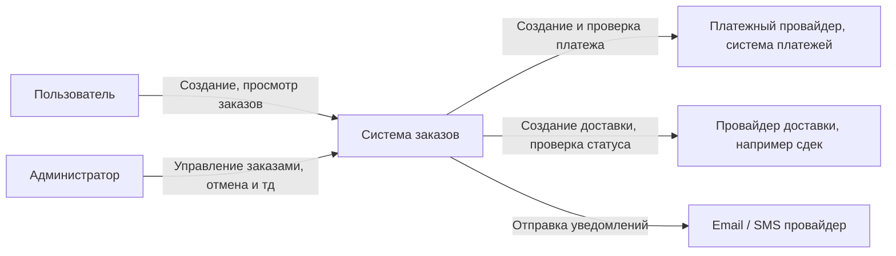
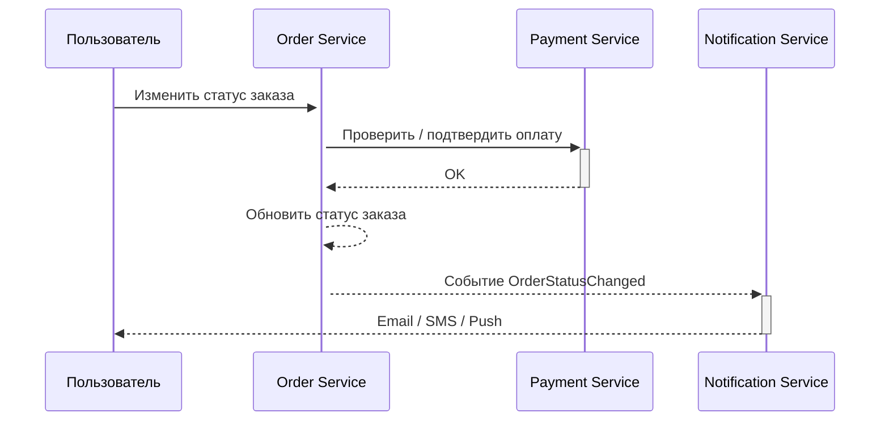

+++
title = 'Решение практического кейса'
weight = 3
+++
# Решение практического кейса

У [задачи](practice.md#практическое-задание) может быть несколько решений, присылайте свои в [чат курса](https://t.me/kirya522_chat)

## Выбор архитектурного подхода

Выбранный подход: **__Модульный монолит__**

Почему так

- Команда небольшая (8 разработчиков), поэтому сложность микросервисов сейчас замедлит работу
- Нагрузки растут, но не критично, поэтому изоляция отдельных сервисов пока менее важна
- Требуется высокая консистентность для платежей - в монолите проще обеспечить транзакции
- Уже есть существующая монолитная реализация - развивать её легче, чем сразу распиливать на микросервисы

## Декомпозиция по доменам

Выделим основное разделение доменов. Ключевая сущность заказы.

| Домен        | Ответственность                                         | Вид                                            |
| ------------ | ------------------------------------------------------- | ---------------------------------------------- |
| Заказы       | Управление заказами (создание, обновление, статус)      | Центральный бизнес-домен                       |
| Пользователи | Регистрация, формирование заказов, отказы и тд          | Актор                                          |
| Оплата       | Обработка платежей, взаимодействие с платёжными шлюзами | Высокая консистентность                        |
| Каталог      | Хранение и выдача информации о товарах                  | Read-heavy                                     |
| Доставка     | Расчёт маршрутов, статусы доставки                      | Интеграция с внешними сервисами                |
| Уведомления  | Отправка e-mail/SMS/Webhook                             | Асинхронный домен и связь с внешними системами |

**Связи**

- Заказ (кто) -> Пользователь
- Заказ (оплачен ли) <-> Оплата (двойная связь для надежности)
- Заказ (статус) <-> Доставка (двойная связь для надежности)
- Заказ (при изменениях) -> Уведомления
- Заказ (вид товара из каталога) -> Каталог 


## Границы системы и владение данными

Источник данных:

- Заказы -> таблица `orders`, ACID
- Пользователи -> таблица `users`, ACID
- Оплата -> таблица `payments`, ACID + Reconcilation + Webhook
- Каталог -> таблица `products`, ACID
- Доставка -> таблица `delivery`, ACID
- Уведомления -> BASE, отдельное хранилище `Notifications`* Можно первым отделить

### Прнцип разделения данных

Каждый домен владеет своей моделью данных, а доступ к другим — только через API. На уровне кода разделяем "сервисы" и репозитории по "доменам"

## Анализ рисков

**Риски**

- Модульный монолит со временем может стать слишком связанным, если модули начнут использовать общие классы и схемы данных
- Масштабирование части системы остаётся грубым, прежде всего каталога
- Команда должна соблюдать дисциплину контрактов между модулями

**Trade-offs**

- Простота разработки сейчас -> возможные сложности при будущем распиле
- Высокая консистентность -> менее гибкие независимые сервисы
- Уведомления хранят много данных -> собираем шишки при выносе так


**ADR**

```md
## Контекст
Команда из 8 разработчиков, требования к высокой консистентности платежей, растущие нагрузки. Система уже существует как монолит.

## Решение
Развивать систему как модульный монолит с чёткими границами доменов, каждым доменом владеет модуль, взаимодействие - через API внутри приложения.

## Альтернативы
- Микросервисы - слишком дорого в текущем масштабе, увеличат сложность
- Оставить монолит без модулей - приведёт к росту связности

## Последствия
+ Меньшая сложность, меньше время на деплой и тесты
+ Высокая согласованность
− Требуются дисциплина и архитектурные тесты
− Возможно перераспиливание в будущем

```

## Схемы

**Схема системы**

```
┌─────────────────────────────┐
|         Клиенты / UI        |
└───────┬─────────────┬───────┘
        │             │
        ▼             ▼
   [API Gateway] -> [Backend (modular)]
        │             │
        │             ├── Orders
        │             ├── Users
        │             ├── Payments
        │             ├── Catalog
        │             ├── Delivery
        │             └── Notifications
        │
    ┌───────────────────────────────────┐
    |          Единая база данных       |
    └───────────────────────────────────┘
```


**Контекстная диаграмма**



Код
```
flowchart LR
    User[Пользователь]
    Admin[Администратор]
    OrderSystem[Система заказов]

    PaymentGateway[Платежный провайдер, система платежей]
    DeliveryService[Провайдер доставки, например сдек]
    NotificationProvider[Email / SMS провайдер]

    User -->|Создание, просмотр заказов| OrderSystem
    Admin -->|Управление заказами, отмена и тд| OrderSystem

    OrderSystem -->|Создание и проверка платежа| PaymentGateway
    OrderSystem -->|Создание доставки, проверка статуса| DeliveryService
    OrderSystem -->|Отправка уведомлений| NotificationProvider
```

**Sequence диаграмма: уведомление о статусе заказа**



Код

```
sequenceDiagram
    participant User as Пользователь
    participant Order as Order Service
    participant Payment as Payment Service
    participant Notification as Notification Service

    User->>+Order: Изменить статус заказа
    Order->>+Payment: Проверить / подтвердить оплату
    Payment-->>-Order: OK

    Order-->>+Order: Обновить статус заказа
    Order-->>+Notification: Событие OrderStatusChanged
    Notification-->>-User: Email / SMS / Push
```

## Контакты

- [telegram канал](https://t.me/kirya522)
- [telegram чат курса и канала](https://t.me/kirya522_chat)
- [boosty автору напрямую](https://boosty.to/kirya522)

Поддержать автора