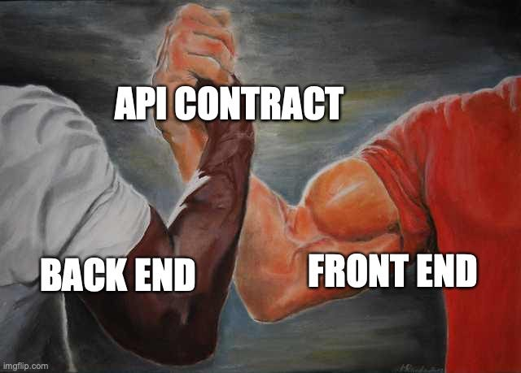
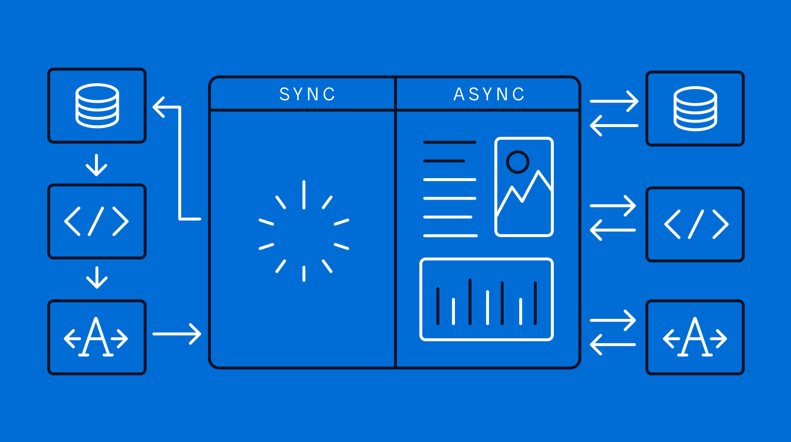
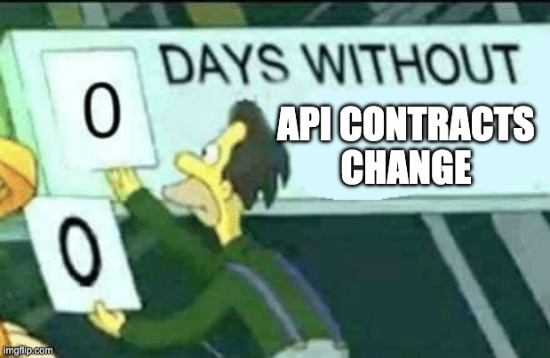

+++
title = 'Контракты и взаимодействие между компонентами'
weight = 2
+++
# Контракты и взаимодействие между компонентами

## Содержимое главы

- Что такое контракт в распределённой системе
- Типы контрактов:
  - HTTP / RPC контракты
  - Асинхронные контракты (events)
- Контракты как точка стабильности системы
- Генерация контрактов и code-first vs contract-first
- Контракты событий и их особенности
- Версионирование контрактов (обратная совместимость)
  - backward compatibility
  - forward compatibility
- Расширение моделей данных без поломки клиентов
- Типичные ошибки при проектировании контрактов

## Что такое контракт

В распределённых системах контракт - это не просто описание API или набор DTO. Контракт - это **явное соглашение между независимыми компонентами**, которые развиваются отдельно и могут находиться под управлением разных команд.

В отличие от монолита, где границы часто размыты и взаимодействие происходит через вызовы функций, в распределённой системе контракт становится единственной формой доверия между компонентами. Он определяет, какие данные можно передавать, **в каком формате**, **с какими гарантиями** и ожиданиями по поведению.
Какие поля являются обязательными, какие опциональными, что гарантировано и на что можно завязываться.

Важно понимать, что нарушение контракта почти всегда приводит к каскадным отказам. Код может успешно собираться и раскатываться, но система в целом перестаёт работать корректно. Именно поэтому контракты требуют такого же внимания, как и бизнес-логика.



## Виды контрактов и способы взаимодействия

На практике чаще всего встречаются два класса контрактов: **синхронные** и **асинхронные**.

Синхронные контракты используются там, где нужен немедленный ответ: HTTP API, RPC-вызовы, gRPC. Они просты для понимания, но создают жёсткую связанность между компонентами. Отказ или замедление одного сервиса напрямую влияет на его зависимости.

Асинхронные контракты основаны на событиях. Сервис публикует факт произошедшего изменения, а потребители обрабатывают его независимо. Такой подход снижает связанность и повышает устойчивость системы, но усложняет отладку и работу с согласованностью данных. Появляется eventual-consistency для клиентов и потребителей.

Выбор между синхронным и асинхронным взаимодействием - это архитектурное решение, а не вопрос удобства разработки.



### Контракты событий

Событийный контракт описывает бизнес-факт, а не команду или техническое действие. Например, `OrderStatusChanged` — это сообщение о том, что состояние заказа изменилось, а не инструкция, что с этим делать.

Ключевой момент - **владение контрактом**. Событие принадлежит домену-автору (publisher), в котором оно произошло. Этот домен определяет структуру события и правила его изменения. Остальные сервисы адаптируются под контракт, но не управляют им.

Неправильное проектирование событий часто приводит к избыточным или слишком абстрактным контрактам, которые со временем начинают протекать деталями внутренней реализации.

### Контракты событий с данными

На практике встречаются два вида событий с данными и без.
Событие с данными отправляет дополнительные детали, которые не требуют повторного похода в систему для чтения актуального состояния.

Например, событие `OrderStatusChanged` может быть следующего вида, сразу понятно что поменялось, не нужно идти за деталями

```
{
  "order_id": 1,
  "changed_at": "dd/mm/yyyy",
  "changedData": {
    "status": "delivered"
  }
}
```

Это позволяет **значительно снизить нагрузку на сервис**, который публикует события, так как клиентам не надо обращаться в систему для проверки, а что же изменилось,
но требуется дополнительная логика обработки событий, также **появляется больший риск расхождения данных**.

### Контракты событий без данных

Используется для упрощения интеграции или же когда потребителям нужна самая актуальная версия на момент выполнения обработки, при большом количестве потребителей вызывает кратный рост читающей нагрузки - требует масштабирования чтения через например реплики.

Событие `OrderStatusChanged` требует уточнения дополнительных деталей для обработки.

```
{
  "order_id": 1,
  "changed_at": "dd/mm/yyyy"
}
```

## Версионирование контрактов

Любой публичный контракт со временем меняется. В распределённой системе важно не столько само изменение, сколько его совместимость с существующими потребителями.
Не все изменения одинаково опасны.

Список **безопасных изменений** для контрактов:

- Добавление нового необязательного поля в запрос
- Добавление нового необязательного поля или структуры данных в ответ
- Удаление входного параметра
- Изменение входного параметра на опциональный ии ослабление валидации входных данных
- Добавление нового значения в enum при условии, что клиенты корректно обрабатывают неизвестные значения

Список операций, **которые скорее всего вызывают проблемы**:

- Изменение семантики существующего поля без изменения его имени
- Изменение типа поля (например, int -> string)
- Изменить значение в enum
- Удалить значение из enum
- Удалить обязательное поле из ответа
- Переименование поля без поддержки старого
- Изменение формата даты / времени
- Добавление нового обязательного поля в запрос

Список **потенциально опасных изменений**

- Использование enum без обработки unknown значений на стороне клиента
- Удаление поля, которое "никто вроде бы не использует"
- Замена null на отсутствие поля или наоборот (или замена null на 0)
- Изменение дефолтных значений
- Использование boolean вместо enum на растущих моделях

Ошибки на этом уровне редко проявляются сразу и часто обнаруживаются уже в продакшене.

При обратно-несовместимых изменениях, которые невозможно безопасно произвести

- Выпускается новая версия обработчиков или событий например `/v2/`
- `/v1/` deprecated, подключение новых клиентов запрещено
- Миграция клиентов на  `/v2/`
- Удаление первой версии



### Фактически на любом проекте

Системы используют аддитивный подход: новые поля добавляются, старые долго не удаляются, значения по умолчанию выбираются осознанно. Удаление и переименование считаются самыми опасными операциями и требуют отдельного планирования. Есть несколько версий эндпоинтов, потому что всех клиентов не успели мигрировать.
Чем больше версий у контрактов, тем сложнее систему поддерживать.

## Генерация контрактов

Кодогенерация позволяет сделать контракт первичным артефактом системы. Из одного описания генерируются клиенты, серверные интерфейсы и модели данных.

Важно понимать ограничения этого подхода. Кодогенерация не решает архитектурных проблем и не защищает от плохого дизайна. Напротив, она делает ошибки более заметными и масштабируемыми.

### OpenAPI (Swagger)

Самый распространённый стандарт для описания HTTP API. [Спецификация](https://swagger.io/specification/)

- Описание REST API в YAML / JSON
- Генерация клиентов и серверных заглушек
- Документация “из коробки”

Инструменты кодогенерации

- Openapi-generator
- Swagger-codegen

Подходит

- Синхронные HTTP API
- Внешние и публичные контракты
- Интеграции между командами

Пример "создание заказа", попробовать [можно тут](https://editor.swagger.io/)
```yaml
openapi: 3.0.3
info:
  title: Orders Service API
  description: Public API for creating orders
  version: 1.0.0

servers:
  - url: https://api.example.com

paths:

  /orders:
    post:
      summary: Create order
      description: Creates a new order in the system
      operationId: createOrder
      requestBody:
        required: true
        content:
          application/json:
            schema:
              $ref: '#/components/schemas/CreateOrderRequest'
      responses:
        '201':
          description: Order successfully created
          content:
            application/json:
              schema:
                $ref: '#/components/schemas/CreateOrderResponse'
        '400':
          description: Invalid request
        '409':
          description: Business conflict (e.g. invalid state)

components:
  schemas:

    CreateOrderRequest:
      type: object
      required:
        - userId
        - items
      properties:
        userId:
          type: string
          description: Identifier of the user who creates the order
        items:
          type: array
          minItems: 1
          items:
            $ref: '#/components/schemas/OrderItem'
        comment:
          type: string
          description: Optional comment for the order

    CreateOrderResponse:
      type: object
      required:
        - orderId
        - status
        - createdAt
      properties:
        orderId:
          type: string
        status:
          type: string
          enum: [CREATED]
        createdAt:
          type: string
          format: date-time

    OrderItem:
      type: object
      required:
        - productId
        - quantity
      properties:
        productId:
          type: string
        quantity:
          type: integer
          minimum: 1

```

### gRPC / бинарные контракты

Контракт описывается в .proto файлах. [Спецификация](https://grpc.io/docs/what-is-grpc/core-concepts/)

- Строго типизированные контракты
- Быстрая сериализация
- Эволюция схем

Подходит для

- Внутренних сервисы
- Строгого контроля версионирования

Пример, тоже создание заказа
```
syntax = "proto3";

package orders.v1;

option go_package = "github.com/example/orders/gen/go/orders/v1";
option java_package = "com.example.orders.v1";
option java_multiple_files = true;

// =======================
// Service
// =======================

service OrdersService {
  rpc CreateOrder (CreateOrderRequest) returns (CreateOrderResponse);
}

// =======================
// Requests / Responses
// =======================

message CreateOrderRequest {
  string user_id = 1;

  repeated OrderItem items = 2;

  // Optional field — safe for extension
  string comment = 3;
}

message CreateOrderResponse {
  string order_id = 1;

  OrderStatus status = 2;

  string created_at = 3; // ISO-8601 (RFC3339)
}

// =======================
// Domain models
// =======================

message OrderItem {
  string product_id = 1;
  int32 quantity = 2;
}

enum OrderStatus {
  ORDER_STATUS_UNSPECIFIED = 0;
  ORDER_STATUS_CREATED = 1;
}

```

### AsyncAPI

Аналог OpenAPI, но для событий и очередей. [Спецификация](https://www.asyncapi.com/docs/reference/specification/v3.0.0)

**Описывает**

- Топики
- События
- Payload
- Продюсеров и консьюмеров

Подходит для

- Event-driven архитектур
- Контракты между продюсерами и консьюмерами

Пример события `OrderCreated` попробовать [можно тут](https://studio.asyncapi.com/)
```
asyncapi: 3.0.0

info:
  title: Orders Events API
  version: 1.0.0
  description: Domain events published by Orders service

channels:
  order.created:
    address: order.created
    messages:
      OrderCreated:
        $ref: '#/components/messages/OrderCreated'

operations:
  publishOrderCreated:
    action: send
    channel:
      $ref: '#/channels/order.created'
    messages:
      - $ref: '#/channels/order.created/messages/OrderCreated'

components:
  messages:
    OrderCreated:
      name: OrderCreated
      title: Order created event
      contentType: application/json
      payload:
        $ref: '#/components/schemas/OrderCreatedPayload'

  schemas:
    OrderCreatedPayload:
      type: object
      required:
        - eventId
        - orderId
        - userId
        - status
        - createdAt
      properties:
        eventId:
          type: string
        orderId:
          type: string
        userId:
          type: string
        status:
          type: string
          enum: [CREATED]
        createdAt:
          type: string
          format: date-time
        items:
          type: array
          items:
            $ref: '#/components/schemas/OrderItem'

    OrderItem:
      type: object
      required:
        - productId
        - quantity
      properties:
        productId:
          type: string
        quantity:
          type: integer
          minimum: 1

```

### Apache Avro / Schema Registry

Часто используется вместе с Kafka. [Спецификация](https://avro.apache.org/docs/1.11.1/specification/)

- Контракты сообщений
- Контроль совместимости (backward / forward)
- Централизованное хранение схем

Подходит для

- Data-платформ
- Потоковой обработки
- Event sourcing

## Рекомендация для курса

Для обучения и практики лучше всего:

- OpenAPI — для HTTP контрактов
- AsyncAPI — для событий
- Protobuf — для строгих внутренних контрактов

## Антипаттерны проектирования контрактов

В распределённых системах часто встречаются следующие проблемы:

- Утечки внутренних моделей через публичные контракты
- Чрезмерная детализация API
- Отсутствие владельца контракта
- Попытка спрятать бизнес-логику в схеме
- Breaking changes без стратегии миграции

Эти ошибки редко выглядят критичными на старте, но со временем становятся источником технического долга и нестабильности системы.

## Дополнительные источники для изучения

- [swagger лучшие практики](https://swagger.io/resources/articles/best-practices-in-api-design/)
- [microsoft rest api guides](https://github.com/microsoft/api-guidelines)
- [opensource api guide](https://opensource.zalando.com/restful-api-guidelines/)
- [статья про версионирование API](https://www.troyhunt.com/your-api-versioning-is-wrong-which-is/)
- [статья и ролик про интеграции между системами](https://kirya522.tech/posts/api-integrations/)
- [статья про синхронные и асинхронные коммуникации](https://kirya522.tech/posts/sync-async-communication/)
- [обратная совместимость в форматах схем](https://docs.confluent.io/platform/current/schema-registry/fundamentals/schema-evolution.html)
- [контракты событий, asyncAPI спецификация](https://www.asyncapi.com/docs/reference/specification/v3.0.0)
- [openapi-generator](https://openapi-generator.tech/)
- [swagger-codgen](https://openapi-generator.tech/)
- [asyncAPI Code Generation](https://www.asyncapi.com/docs/tools/generator)
- [json-schema](https://json-schema.org/)
- [protobuf](https://protobuf.dev/)
- [gRPC](https://grpc.io/docs/what-is-grpc/introduction/)
- [apache avro](https://avro.apache.org/)
- книга Building Microservices - Sam Newman
- книга Designing Event Driven Systems - Ben Stopford
- книга Designing Data-Intensive Applications - Martin Kleppmann

## Практика

В первом модуле:

- Выбрали архитектурный подход (монолит / модульный монолит / микросервисы)
- Выделили домены
  - Заказы
  - Оплата
  - Каталог
  - Доставка
  - Уведомления
- Определили границы сервисов и владение данными
- Зафиксировали решение через ADR
- Нарисовали контекстную и компонентную схемы.

Во втором модуле мы оживляем эти границы — через реальные контракты взаимодействия между доменами.

### Задание

Система заказов развивается. Появляется требование.

```md
При изменении статуса заказа система уведомлений должна получать событие,
а внешние клиенты — иметь стабильный HTTP API для чтения заказа.
```

Это приводит к двум типам контрактов:

- HTTP контракт для чтения состояния заказа
- Event контракт для реакции других доменов

#### Часть 1. Контракты домена «Заказы» (HTTP)

Спроектировать публичный HTTP контракт сервиса заказов.

Требования

- Клиенты
  - Frontend
  - Сервис уведомлений (read-only)
- Операции
  - Получить заказ по id
  - Получить список заказов пользователя
- Контракт должен быть
  - Версионируемым
  - Допускать расширение модели
  - Пригодным для кодогенерации

Практика

1. Создать файл `orders-api.yaml`
2. Описать
   - `/orders/{id}`
   - `/orders?userId={}` или `/orders/users/{id}`
3. Использовать
   - Явные типы
   - Enums для статусов
   - Optional поля
4. Сгенерировать для своего языка программирования (java, golang, ...)
   - DTO модели
   - Http клиент
5. Используя `openapi-generator` или другие инструменты кодогенерации
6. Артефакты
   - Сгенерированные модели
   - README с инструкцией генерации
   - ADR: по фиксации подхода

Пример фрагмента

```yml
order:
  type: object
  required:
    - id
    - status
    - createdAt
  properties:
    id:
      type: string
    status:
      type: string
      enum: [CREATED, PAID, SHIPPED, CANCELLED]
    totalPrice:
      type: number
    createdAt:
      type: string
      format: date-time
```

#### Часть 2. Контракты событий (уведомления о статусе заказа)

Сервис уведомлений не должен

- Ходить в БД заказов
- Синхронно дергать API заказов, реагирует только на события асинхронно

Практика

1. Спроектировать контракт события: `OrderStatusChanged`
2. Создать `orders-events.yaml`
3. Описать
   - Канал `order.status.changed`
   - Payload события
   - Producer / consumer
4. Сгенерировать для своего языка программирования (java, golang, ...)
   - Event DTO
   - Consumer interface / handler
5. Артефакты
   - Схема события
   - Сгенерированные модели
   - Пример обработчика (псевдокод)

Пример payload

```yaml
OrderStatusChanged:
  type: object
  required:
    - orderId
    - oldStatus
    - newStatus
    - changedAt
  properties:
    orderId:
      type: string
    oldStatus:
      type: string
    newStatus:
      type: string
    changedAt:
      type: string
      format: date-time
```

#### Часть 3. Развитие контрактов

Бизнес приходит с новыми требованиями:

- Добавить `deliveryType` (вид доставки)
- Добавить новый статус `RETURNED`
- Убрать поле `totalPrice` из ответа

Практика.
Для каждого изменения

1. Определить
    - Safe / unsafe
2. Выбрать стратегию
    - Расширение
    - Новая версия
    - Миграция
    - ...
3. Артефакты
    - Решение по каждому кейсу и обоснование
