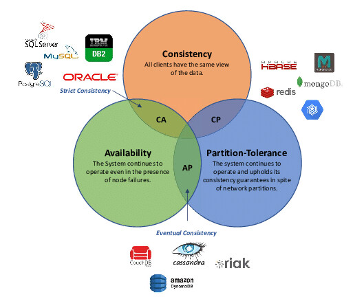
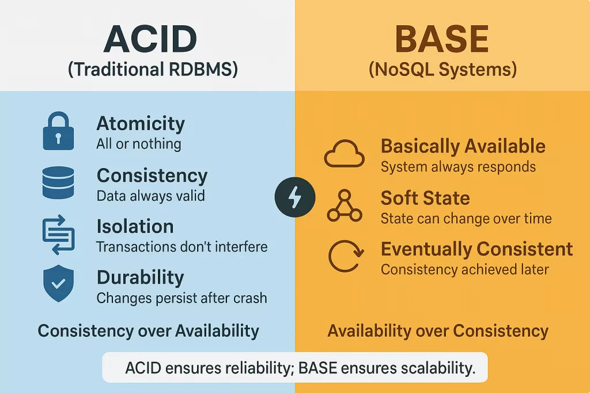
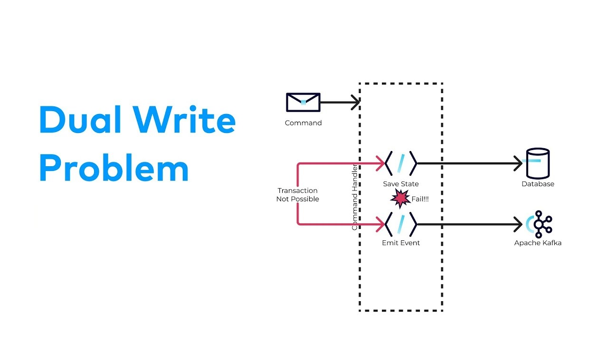
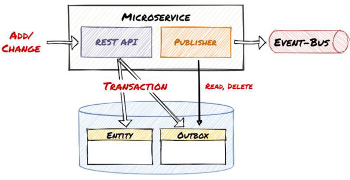
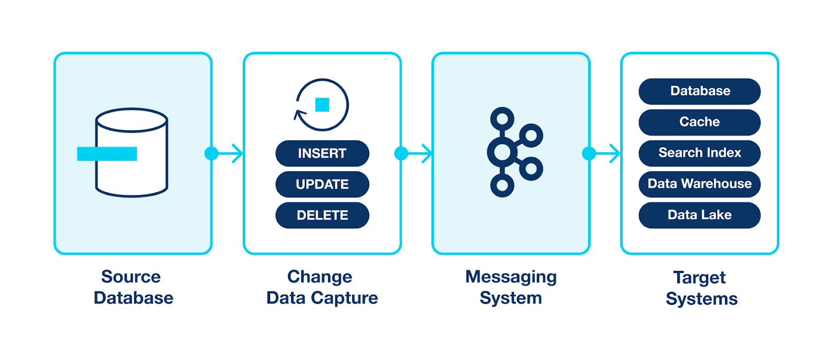
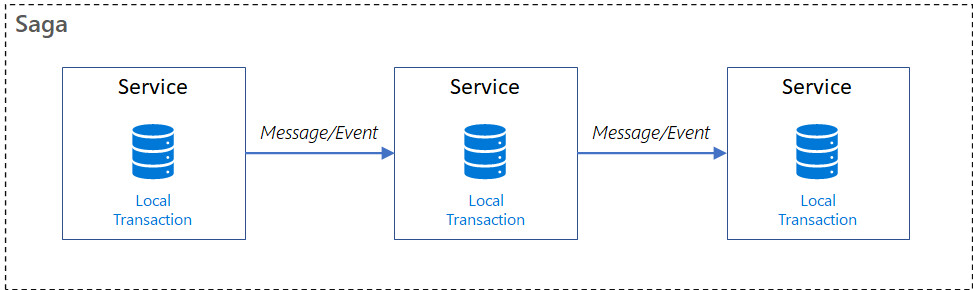
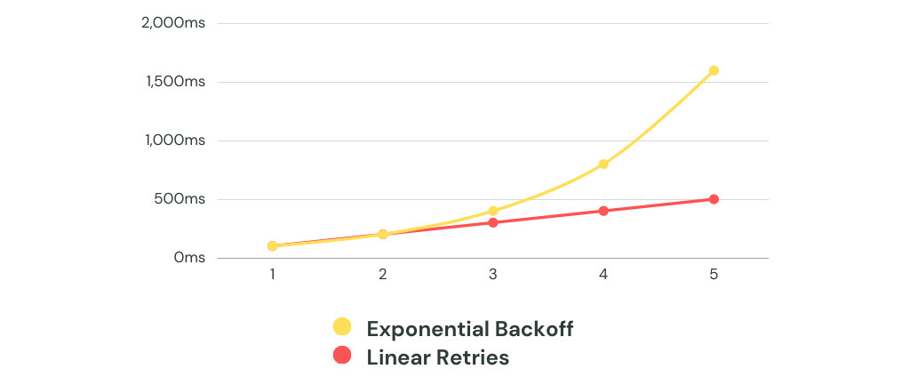

+++
title = 'Консистентность данных и распределённые отказы'
weight = 3
+++
# Консистентность данных и распределённые отказы

## Содержимое главы

- CAP теорема
- Почему консистентность - одна из главных проблем распределённых систем
- Trade-offs между доступностью и консистентностью
- ACID vs BASE
- Strong consistency, eventual consistency, causal consistency
- Несколько источников данных и проблема расхождений, чтение устаревших данных
- Синхронизация состояний между сервисами
- Dual write, outbox, CDC, event sourcing, SAGA
- Retry, backoff, circuit breaker

## Консистентность данных и распределённые отказы

В монолите консистентность почти всегда воспринимается как данность. Есть одна база данных, изменения в одной транзакции, один источник истины. Пока запрос не закоммичен, изменения не видны, после коммита, система находится в согласованном состоянии. В распределённой системе эта модель перестаёт работать практически сразу.

> Транзакция в базе данных (БД) - это логическая единица работы, объединяющая несколько операций (чтение, запись, обновление) в единое целое: они либо выполняются все и успешно, либо ни одна не выполняется, чтобы сохранить целостность данных

Как только данные начинают жить в нескольких сервисах, репликах, кэшах или очередях, консистентность превращается в eventual (когда-то наступит, а может и нет). Любое сетевое взаимодействие может замедлиться, оборваться или выполниться повторно. Это означает, что расхождения данных **могут происходить и это нормально**.

## CAP теорема



> Теорема CAP (Consistency, Availability, Partition tolerance) - это
фундаментальный принцип распределенных систем, утверждающий, что одновременно можно обеспечить только два из трех свойств: Согласованность (данные одинаковы на всех узлах), Доступность (система всегда отвечает на запросы) и Устойчивость к разделению (система работает, даже если сеть разделена). В случае сетевого разделения (P), система вынуждена выбирать между Согласованностью (CP) и Доступностью (AP). 

Или детально

- Consistency (Согласованность): Все узлы видят одни и те же данные в один и тот же момент времени; каждая операция чтения возвращает последнюю записанную запись.
- Availability (Доступность): Каждый запрос к не отказавшему узлу получает ответ, даже если данные могут быть устаревшими.
- Partition tolerance (Устойчивость к разделению): Система продолжает работать, даже если связь между узлами нарушена (разделилась). 

И в разных задачах приходится делать разные решения

- Платёжная система чаще жертвует доступностью(A) ради консистентности(C) - CP
- Лента новостей почти всегда выбирает доступность(A), допуская устаревшие данные - AP

## ACID vs BASE

**ACID** модель гарантий чаще всего транзакционных (RDBMS) вырос из мира централизованных баз данных и предполагает строгие гарантии

- Атомарность
- Согласованность
- Изоляцию
- Надёжность (Долговечность)

Со строгими гараниями накладываются ограничения по производительности и масштабированию систем, есть другой подход распределенных систем - **BASE.**

- Basically Available, система отвечает почти всегда
- Soft state, состояние может быть временно неконсистентным
- Eventual consistency, со временем данные сходятся

Важно не воспринимать **BASE как «хуже, чем ACID»**. Это другая модель, например для системы целиком оптимизированная под масштаб, отказоустойчивость и асинхронность. 
В реальных системах часто используется гибрид: **внутри сервиса ACID, между сервисами BASE.**



## Модели консистентности. От строгой к ослабленной

**Strong consistency**, после записи все последующие чтения видят новое значение. Просто для понимания, но дорого и плохо масштабируется.

**Eventual consistency** допускает, что некоторое время разные участники видят разные данные, но гарантирует, что в итоге система придёт к единому состоянию. Большинство event-driven систем живут именно в этой модели.

**Causal consistency** находится между ними. Она гарантирует, что причинно-следственные связи сохраняются: если одно событие произошло после другого, наблюдатели увидят их в правильном порядке. Это часто используется в системах с пользовательскими действиями и цепочками событий.

### Пример eventual consistency

Как только система начинает масштабироваться под нагрузку, возникает вопрос: какой источник является истинным и когда остальные догоняют его состояние.
 
- Основная база
- Реплики (асинхронные)
- Кеш
- Внешние источники данных

Сценарий:

- Заказ создан
- Статус обновился в Orders
- Событие ушло в очередь
- Notifications обновился позже (еще не обработал сообщение)
- Клиент не получил уведомление (хотя состояние уже изменилось)

## Синхронизация состояний между сервисами

Синхронизация в распределённых системах почти всегда асинхронна

- Нет общей транзакции
- Нет гарантии мгновенного обновления
- Есть повторная доставка сообщений и возможны дубли (про стратегии борьбы будет следующий модуль)

Поэтому корректная синхронизация использует

- Событий как фактов (без данных). Событие без данных из модуля 2. Контракты.
- Идемпотентность обработки
- Способности переживать повторы и задержки

> Идемпотентность - это свойство операции, при котором многократное ее выполнение с одинаковыми входными данными дает тот же результат, что и однократное, не вызывая дополнительных изменений в системе

На практике используются ключи идемпотентности

> Ключ идемпотентности - это уникальный идентификатор (обычно UUID), который клиент генерирует для каждого критичного запроса, чтобы сервер мог распознавать повторные запросы и предотвращать дублирование операций, например, двойное списание денег.

## Стратегии синхронизации данных между сервисами

### Dual write (антипаттерн)



- Записали изменение в базу
- Отправили событие в брокер
- **Получили самую популярную проблему проектирования систем**

```
BEGIN
  UPDATE orders
  PUBLISH OrderUpdated
COMMIT
```

**Проблемы**

- БД закоммитилась, событие не ушло
- Событие ушло, БД не закоммитилась
- Нет атомарности между БД и брокером

### Transactional Outbox (паттерн Outbox)

Самый распространённый и практичный паттерн.



**Идея**

- Событие записывается в ту же БД и в той же транзакции, что и бизнес-данные
- Отдельный процесс публикует события из outbox в брокер

```
BEGIN
  UPDATE orders
  INSERT INTO outbox (event_type, payload)
COMMIT

Outbox Poller → Kafka / RabbitMQ
```

**Плюсы**

- Атомарность
- Нет потери событий
- Хорошо масштабируется

**Минусы**

- Дополнительная таблица (и чаще всего тригеры в базе на создание)
- Нужно чистить outbox
- Eventual consistency

**Стандарт для event-driven архитектур.**

### Change Data Capture (CDC)



CDC анализирует журналы транзакций (логи) базы данных (например, SQL Server, Oracle, MySQL) или использует триггеры и временные метки для фиксации изменений. Ведет свой курсор по логу и повторяет операции базы данных.
По-сути ведет себя как реплика.

**Как работает**

- БД пишет WAL / binlog
- CDC-инструмент (например, Debezium) читает лог
- Изменения превращаются в события

```
DB → WAL → CDC → Kafka
```

**Плюсы**

- Приложение не знает о событиях
- Нет dual write

**Минусы**

- Сложнее инфраструктура
- События отражают изменения данных, а не факты
- Слабый контроль контрактов

**Где применимо**

- Data платформы
- Репликация
- Аналитика


### Event Sourcing (сомнительно, но окэй)

Источник истины — сами события, а не состояние.

- Состояние вычисляется из потока событий
- БД = append-only log
```
OrderCreated
OrderConfirmed
OrderCancelled
```

**Плюсы**

- Полная история изменений
- Лёгкий replay (повторение изменений)
- Отлично для аудита (проверки что было в системе)

**Минусы**

- Сложная модель
- Высокий порог входа
- Для получения актуального состояния нужно выполнить все события для текущего момента
- Для нормальной производительности события нужно сжимать

### SAGA



> Паттерн Saga - это способ управления распределенными транзакциями в микросервисной архитектуре, который разбивает длинную бизнес-операцию на последовательность локальных транзакций в разных сервисах, обеспечивая согласованность данных с помощью компенсирующих транзакций в случае сбоя.

Пример
```
CreateOrder
→ ReserveStock
→ ChargePayment
→ ConfirmOrder
```

Шаг упал, откатываем (но откат может тоже упасть)
```
RefundPayment
→ ReleaseStock
```

**Saga бывает**

- Оркестрация (центральный координатор)
- Хореография (через события)

#### Saga с оркестрацией (центральный координатор)

В этой модели есть один сервис-оркестратор, который

- Знает весь бизнес-процесс
- Вызывает шаги по порядку
- Принимает решения при ошибках
- Инициирует компенсации
```
OrderSaga (оркестратор)
  ↓
CreateOrder
  ↓
ReserveStock
  ↓
ChargePayment
  ↓
ConfirmOrder
```

**Плюсы оркестрации**

- Явная бизнес-логика
- Проще отлаживать
- Легче контролировать ошибки
- Понятный жизненный цикл саги

**Минусы оркестрации**

- Центральная точка управления
- Оркестратор может разрастаться
- Более сильная связность сервисов

**Когда использовать оркестрацию**

- Сложный бизнес-процесс
- Чёткая последовательность шагов
- Высокая цена ошибки (деньги, SLA)
- Нужно управлять тайм-аутами и ретраями

Пример: Платежи, биллинг, подписки, e-commerce

#### Saga с хореографией (через события)

В этой модели нет центрального координатора.
Каждый сервис

- Реагирует на события
- Выполняет свою часть
- Публикует новое событие
- Не знает всей цепочки целиком
```
OrderCreated
 → InventoryService
   → StockReserved
     → PaymentService
       → PaymentCharged
         → OrderConfirmed
```

**Плюсы хореографии**

- Нет единой точки отказа
- Слабая связность сервисов
- Хорошо масштабируется
- Естественно ложится на event-driven архитектуру

**Минусы хореографии**

- Трудно понять общий процесс
- Сложнее дебажить
- Легко получить "спагетти из событий"
- Неочевидные зависимости между сервисами

**Когда использовать хореографию**

- Простые бизнес-процессы
- Много сервисов-подписчиков
- Высокая автономность команд
- Event-first архитектура

Пример: Уведомления, аналитика, фоновые процессы.

### Read-model синхронизация (CQRS-подход)

Часто сервисы не синхронизируют данные, а строят свои "копии объектов"

- Один сервис — источник истины
- Остальные держат локальные read-модели
- Обновляются через события
```
Orders → OrderCreated → Billing / Notifications
```

**Плюсы**

- Нет shared DB
- Слабая связность
- Масштабируемость

**Минусы**

- Если события теряются или что-то не так, то нужна полная реконсиляция данных из мастер систем в зависимости (или даже регулярная)
- Устаревшие данные это норма
- Нужно уметь жить с eventual consistency

## Retry, backoff, circuit breaker как часть архитектуры'

- Retry, способ пережить временные сбои (попробуем повторить операцию).
- Backoff, способ не добить систему в момент деградации (каждый ретрай начинаем делать с задержкой).
- Circut breaker, способ предотвращения каскадных сбоев в распределенных системах, временно блокирует запросы к отказавшему сервису, позволяя ему восстановиться и не перегружать его.

Если мы будем много делать Retry, то зависимости не смогу восстановиться, поэтому используется комбинация паттернов.

И важно определить
- Какие операции можно повторять
- Сколько раз
- С каким интервалом
- Где повтор недопустим




## Дополнительные материалы

- [CAP Twelve Years Later](https://www.infoq.com/articles/cap-twelve-years-later-how-the-rules-have-changed/)
- [Consistency models](https://jepsen.io/consistency/models)
- [Eventual consistency](https://www.allthingsdistributed.com/2008/12/eventually_consistent.html)
- [ACID](https://habr.com/ru/articles/535616/)
- [ACID vs Base](https://habr.com/ru/articles/906220/)
- [Transactional outbox](https://microservices.io/patterns/data/transactional-outbox.html)
- [debezium](https://debezium.io/documentation/)
- [Проблема dual-write](https://www.confluent.io/blog/dual-write-problem/)
- [Про ключи идемпотентности](https://habr.com/ru/companies/domclick/articles/779872/)
- [Circuit breaker](https://habr.com/ru/companies/otus/articles/778574/)
- [Еще про circuit breaker](https://martinfowler.com/bliki/CircuitBreaker.html)
- [Event sourcing](https://martinfowler.com/eaaDev/EventSourcing.html)
- [SAGA](https://microservices.io/patterns/data/saga.html)
- [SAGA виды](https://www.baeldung.com/cs/saga-pattern-microservices)
- Книга Designing Data-Intensive Applications - Martin Kleppmann
- Книга Release It! - Michael Nygard

## Контакты

- [telegram канал](https://t.me/kirya522)
- [telegram чат курса и канала](https://t.me/kirya522_chat)
- [boosty автору напрямую](https://boosty.to/kirya522)

Поддержать автора