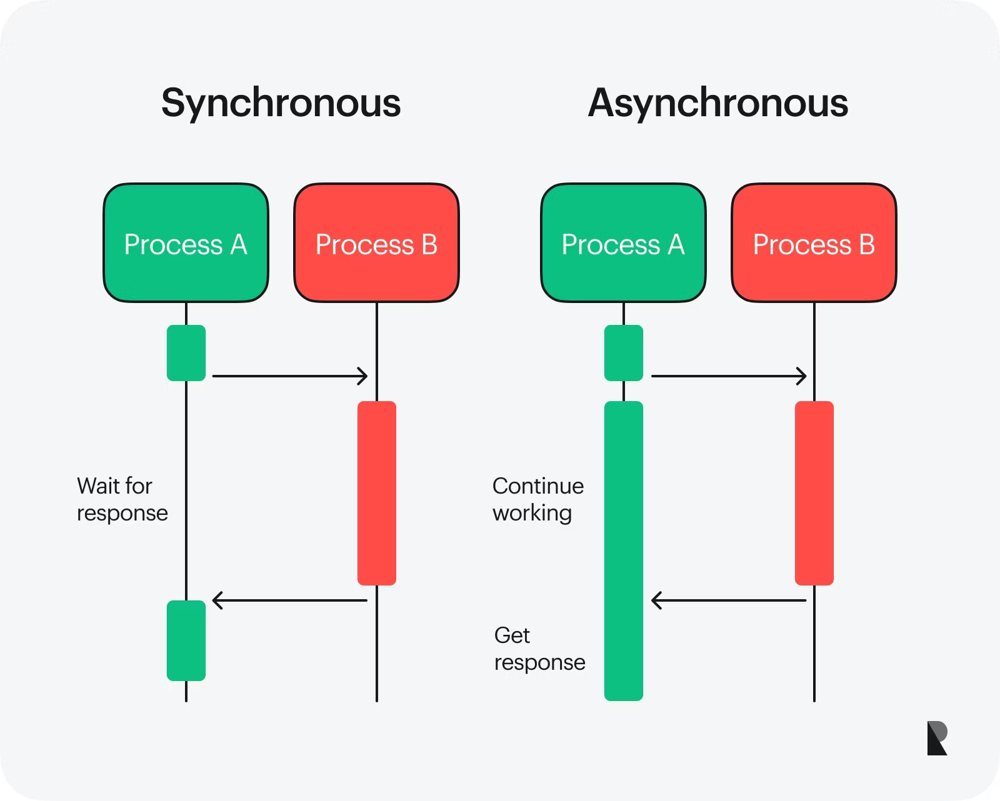
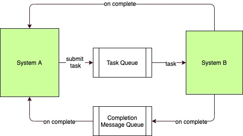
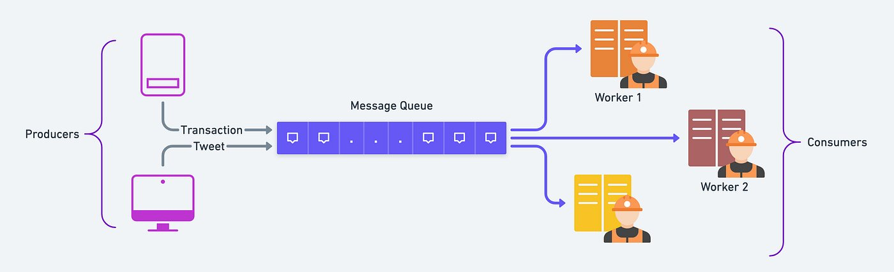
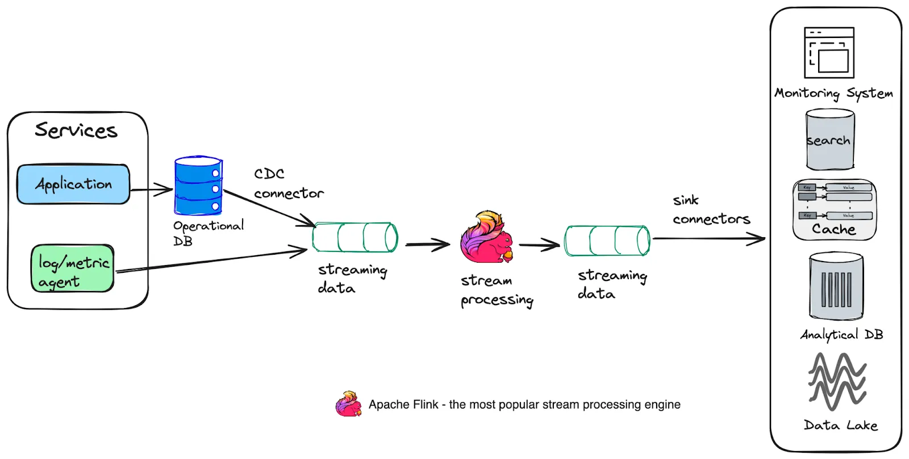
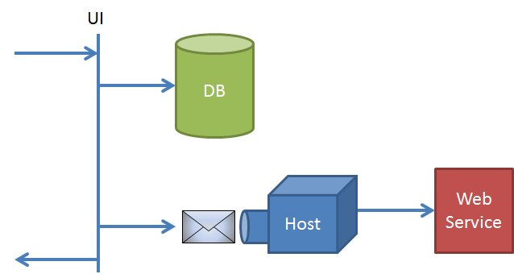
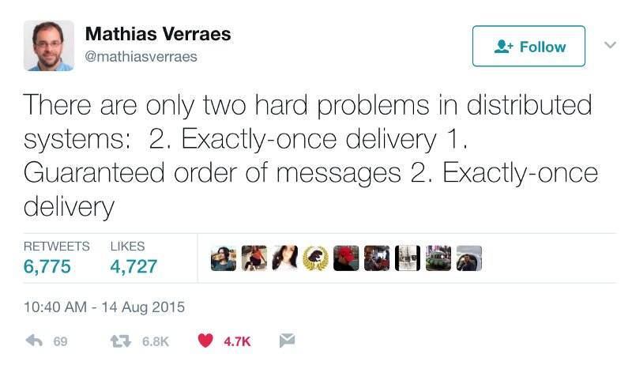
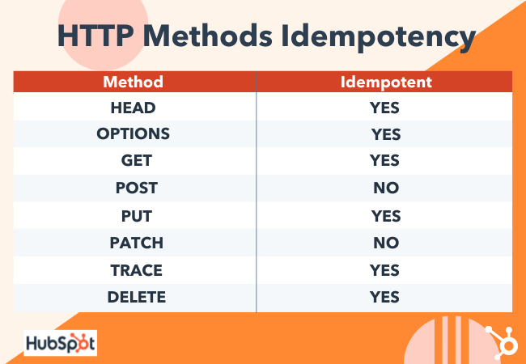
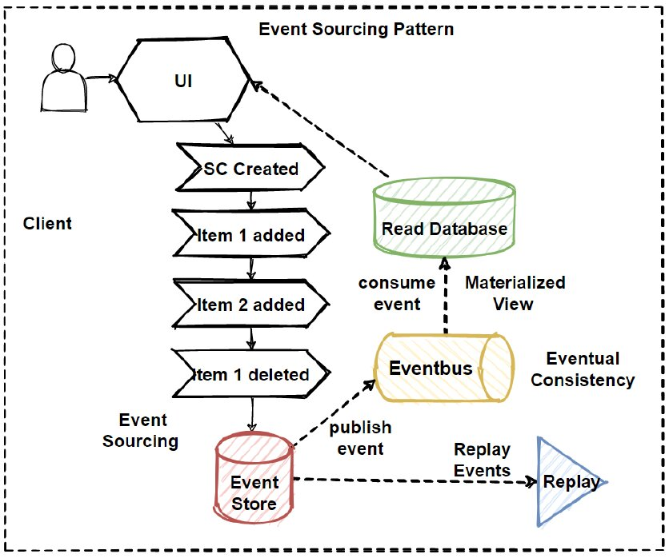

+++
title = 'Асинхронность и событийные архитектуры'
weight = 4
+++
# Асинхронность и событийные архитектуры

## Содержимое главы

- Event driven architecture
- CQRS, event sourcing
- Зачем асинхронность в распределённых системах
- Очереди и стриминг как архитектурный компонент
- Синхронное vs асинхронное взаимодействие
- Отложенные события и фоновые задачи
- Проблема дублей сообщений
- At-least-once и at-most-once delivery, почему не существует exactly-once
- Идемпотентность обработчиков
- Outbox pattern, как помогает синхронизировать данные

## Зачем асинхронность в распределённых системах

В распределённых системах синхронное взаимодействие - это естественный способ общения: запрос–ответ, HTTP, RPC. Он прост и понятен: вызывающий сервис отправляет запрос другому и получает ответ. Но на практике такие системы быстро сталкиваются с проблемами:

1. Связность: при синхронных вызовах один компонент зависит от другого в режиме реального времени. Если один сервис падает — падают все потребители.
2. Производительность: синхронные вызовы блокируют поток до получения ответа, что ограничивает пропускную способность.
3. Масштабирование: увеличение числа синхронных зависимостей усложняет горизонтальное масштабирование и увеличивает латентность.
4. Отказы: сеть и сервисы неизбежно падают. Синхронные зависимые вызовы превращаются в точки отказа.

Асинхронность позволяет смягчить эти проблемы. Вместо прямого ожидания ответа, системы публикуют события или сообщения в очередь/поток, а другие компоненты обрабатывают их в собственном темпе. Это снижает связанность, улучшает устойчивость к отказам и повышает пропускную способность.



## Синхронное vs асинхронное взаимодействие

| Характеристика                      | Синхронное | Асинхронное |
| ----------------------------------- | ---------- | ----------- |
| Зависимость в реальном времени      | Да         | Нет         |
| Ответ в момент вызова               | Да         | Нет         |
| Работа в условиях частичного отказа | Сложно     | Легче       |
| Масштабирование                     | Ограничено | Хорошо      |
| Сложность обработки ошибок          | Меньше     | Больше      |
| Проблемы eventual consistency       | Нет        | Да          |

Асинхронное взаимодействие подходит для операций, где важно мгновенное подтверждение или результат. Но в распределённых системах часто выгоднее использовать асинхронность для фоновых задач, интеграций или обработок, которые не требуют мгновенного ответа.

## Event-Driven Architecture (EDA)

Event-Driven Architecture (EDA) — архитектурный стиль, в котором компоненты системы взаимодействуют через события — факты, описывающие произошедшие изменения, а не команды или запросы. В EDA:

- Сервис публикует событие (например, OrderCreated).
- Другие сервисы подписываются на события и обрабатывают их.
- Нет жестких зависимостей по времени: сервисы не должны быть онлайн одновременно.

Почему EDA важна:

- Снижает связанность компонентов;
- Улучшает отказоустойчивость;
- Поддерживает горизонтальное масштабирование;
- Естественно сочетается с очередями/стримингом.



## Очереди и стриминг как архитектурные компоненты

Асинхронное взаимодействие в распределённых системах строится вокруг передачи событий и задач между компонентами.
При этом «очередь» и «стрим» — это не столько разные технологии, сколько разные модели использования одних и тех же механизмов.

Один и тот же брокер сообщений (например, Kafka) может выступать и как очередь, и как стрим — в зависимости от того, как организовано потребление и хранение сообщений.

### Очереди (Queues)

Очередь — это модель, в которой каждое сообщение обрабатывается ровно одним потребителем из группы.
**Ключевые характеристики:**

- Сообщение после обработки исчезают и считаются обработанными
- Несколько потребителей масштабируют обработку, но не дублируют работу
- Порядок важен внутри логического ключа или партиции

**Типичные сценарии:**

- Фоновые и отложенные задачи
- Обработка команд (command processing)
- Интеграции, где действие должно быть выполнено один раз
- Rate limiting и выравнивание нагрузки.

В Kafka эта модель реализуется через consumer group: сообщение из партиции будет доставлено только одному consumer’у в группе.



### Потоки (Streams)

Стрим — это модель, в которой сообщения сохраняются как журнал событий, а каждый потребитель читает их независимо.
**Ключевые характеристики:**

- Сообщения не "исчезают" после чтения
- Один и тот же поток может быть прочитан разными сервисами
- Возможен повторный просмотр истории (replay)
- Порядок гарантируется внутри партиции

**Типичные сценарии:**

- Событийная архитектура (event-driven)
- Аналитика и агрегации
- Построение read-моделей
- Интеграция множества систем через события

В Kafka стриминговая модель достигается созданием нескольких consumer group, каждая из которых читает один и тот же топик как независимый стрим.


## Отложенные события и фоновые задачи

Часто часть логики системы не является критичной для мгновенного ответа клиенту.
Например:

- Отправка email после создания заказа;
- Расчёт статистики;
- Обновление агрегированных метрик.

В таких случаях события откладываются в очередь/поток и обрабатываются фоновой задачей, что:

- Уменьшает задержки синхронных операций;
- Повышает устойчивость системы;
- Снижает влияние отказов сторонних сервисов.



## Проблема дублей сообщений

В асинхронных системах одно из фундаментальных препятствий — дубли сообщений.

**Причины дублей:**

- Повторная доставка при ошибках;
- Сетевые повторные попытки;
- Рестарты потребителей;
- Брокеры с at-least-once гарантией.

Дубли — случаются, система должна уметь переживать повторы.

## At-least-once и at-most-once delivery

| Гарантия          | Смысл                                                                                                   |
| ----------------- | ------------------------------------------------------------------------------------------------------- |
| **At-most-once**  | Сообщение доставлено 0 или 1 раз                                                                        |
| **At-least-once** | Сообщение доставляется 1 или более раз                                                                  |
| **Exactly-once**  | Доставка ровно один раз — теоретически, но **не реализуема** в распределённых системах без компромиссов |

## Почему нет exactly-once

Exactly-once требует:

- Атомарную запись в брокер и бизнес-логикой
- Отсутствия дубликатов в сети и системе обработки

В реальных распределённых системах это невозможно гарантировать без центрального координирования и глобальных транзакций, которые блокируют масштабирование.
Реально проектируется под **at-least-once + идемпотентность**.
И получем потенциальный **exactly-once** с оговорками.



## Идемпотентность обработчиков

Идемпотентность - способность многократного применения одной операции давать тот же результат, что и однократное.

В event-driven системах идемпотентность - обязательное свойство.
**Оно достигается через:**

- Уникальные ключи идемпотентности (event_id)
- Запись состояния обработки событий (кеш)
- Использование логов событий/триггеров

**Потребитель события должен уметь:**

- Определять дубликаты
- Игнорировать повторные обработки



## Outbox pattern как способ синхронизации

Outbox pattern решает известную проблему dual write:
когда изменение в базе данных и публикация события в брокер не могут быть атомарными по умолчанию.
Подробно разобран в [предыдущем модуле](../03_consistency/_index.md#transactional-outbox-паттерн-outbox)

## CQRS и event sourcing

CQRS (Command Query Responsibility Segregation)
**CQRS разделяет:**

- Команды (обновление состояния)
- Запросы (чтение состояния)

Вместо одной модели на чтение/запись выносится оптимизированная read-модель.

**Асинхронность здесь помогает:**

- Обновлять read-модели через события
- Разгружать транзакционные базы
- Поддерживать разные форматы и формы хранения

## Event Sourcing

Вместо хранения актуального состояния — хранится поток событий, из которого состояние восстанавливается.
И состояние рассчитывается после применения всех событий.

```
OrderCreated → OrderPaid → OrderShipped
```

Плюсы:

- Делает историю неизменной
- Позволяет делать replay (пересчитать состояние)
- Даёт audit-trail, возможность проводить аудит

Минусы:

- Сложность модели
- Необходимость сжатия/снапшотов (для опимизации работы)



## Дополнительные источники

- [Event-Driven Architecture](https://martinfowler.com/articles/201701-event-driven.html) — Martin Fowler
- [Outbox Pattern](https://microservices.io/patterns/data/transactional-outbox.html)
- [Exactly-Once Semantics](https://exactly-once.github.io/posts/exactly-once-delivery/)
- [CQRS](https://martinfowler.com/bliki/CQRS.html)
- [CQRS medium](https://medium.com/learn-agile-practices/cqrs-pattern-advantages-of-command-and-queries-fd83396dd942)
- [Event Sourcing](https://martinfowler.com/eaaDev/EventSourcing.html)
- [Backoff](https://aws.amazon.com/blogs/architecture/exponential-backoff-and-jitter/)
- [Idempotent Consumer Patterns](https://microservices.io/patterns/communication-style/idempotent-consumer.html)

## Контакты

- [telegram канал](https://t.me/kirya522)
- [telegram чат курса и канала](https://t.me/kirya522_chat)
- [boosty автору напрямую](https://boosty.to/kirya522)

Поддержать автора